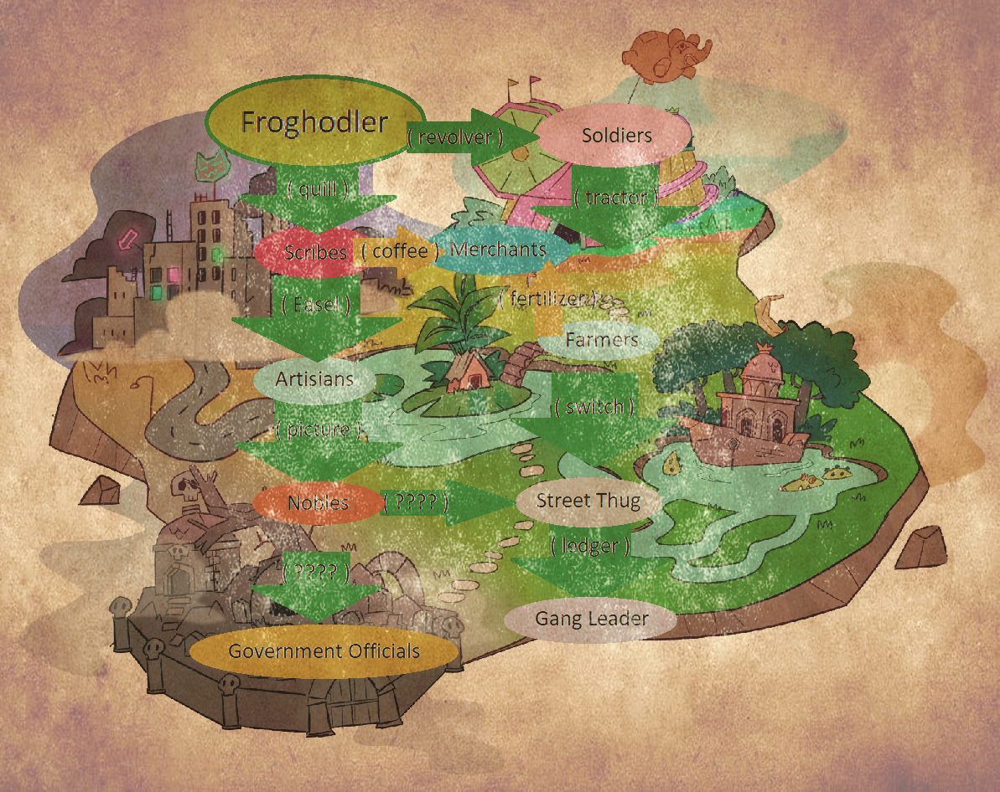

# 🧙 More Role Info

## Gameplay Roles

<strong>Soldiers</strong>

Foot soldiers on the ground floor of Frogland's crime syndicates. Can be obtained through the purchase and use of a _Revolver._

**Pays:** 5,000 Frogdollars every 24 hours

<strong>Scribes</strong>

The writing historians of Frogland. Can be obtained with the purchase and use of a _Quill_.

**Pays:** 5,000 Frogdollars every 24 hours

<strong>Farmers</strong>

The bread and butter of Frogland's food production system. Can be obtained with the purchase and use of a _Tractor_.

**Role Required:** _Soldier_

**Pays:** 10,000 Frogdollars every 24 hours

<strong>Merchants</strong>

Shop owners and sellers of Forgland. Can be obtained through the purchase and use of _Coffee and Spaghetti or Fertilizer._

**Role Required**: _Scribes_ \*\*\*\* or \*\*\*\* _Farmer_.

**Pays:** 15,000 Frogdollars every 24 hours

<strong>Artisans</strong>

Skilled workers and craftsman of Frogland. Can be obtained through the purchase and use of an _Easel_.

**Role Required**: _Scribes_

**Pays:** 10,000 Frogdollars every 24 hours

<strong>Nobles</strong>

The rich and powerful of Frogland. Can be obtained with the purchase and use of a _Picture Frame_.

**Role Required**: _Artisans_

**Pays:** 15,000 Frogdollars every 24 hours

<strong>Street Thug</strong>

Confidants and second hands of Frogland's crime syndicate, supporting the Gang Leaders. Can be obtained through the purchase and use of a _Froglex or Switch-Blade Knife_.

**Role required**: _Noble_ or _Farmers_

**Pays:** 10,000 Frogdollars every 24 hours

<strong>Gang Leader</strong>

Crime lords of New Pangea. Can be obtained with the purchase and use of a _Ledger._

**Role **_**\*\*\*\***_** Required**: _Street Thug_

**Pays:** 20,000 Frogdollars every 24 hours

<strong>Government Official</strong>

Head politicians of Frogland, can be obtained with the purchase and use of a _Telegram from Gutterville._

**Role **_**\*\*\*\***_** Required**: _Noble_

**Pays:** 20,000 Frogdollars every 24 hours


Each of the **Gangs** also has their own role for ease of tagging, but no payout.


## **Frog Based Roles**

<strong>aaaaaaFROGHODLRaaaaaa</strong>

Denounces official ownership of a frog(s) through wallet connect.

**Pays:** 10,000 Frogdollars every 24 hours

<strong>Ringleader</strong>

Ownership of 7+ Notorious Frogs.

**Pays:** 15,000 Frogdollars every 24 hours

<strong>Boss</strong>

Ownership of 20+ Notorious Frogs.

**Pays:** 20,000 Frogdollars every 24 hours

<strong>Don</strong>

Ownership of 50+ Notorious Frogs.

**Pays:** 25,000 Frogdollars every 24 hours

<strong>Guardian</strong>

Ownership of 100+ Notorious Frogs.

**Pays:** 30,000 Frogdollars every 24 hours

frOG LSD Hodlr

Ownership of a _claimed_ Land Synthesis Device - thus, an OG frog who was able to claim their free land (or purchased an OG device on the secondary) rather than minted.

**Pays:** 12,000 Frogdollars every 24 hours

LSD Hodlr

Ownership of a _minted_ Land Synthesis Device.&#x20;

**Pays:** 10,000 Frogdollars every 24 hours. &#x20;

## Contribution Based Roles

<strong>Mod 1 - Frogspawn Moonboi</strong>

The first level of Mod Squad status.

**Pays:** 25,000 Frogdollars every 24 hours

<strong>Mod 2 - Lunar Tadpole</strong>

The second level of Mod Squad status.

**Pays:** 30,000 Frogdollars every 24 hours

<strong>Mod 3 - Astro Frogling</strong>

The third level of Mod Squad status.

**Pays:** 35,000 Frogdollars every 24 hours

<strong>Mod 4 - Notorious Maxi</strong>

The fourth level of Mod Squad status.

**Pays:** 40,000 Frogdollars every 24 hours

<strong>The Daily Splat Team</strong>

The frogs behind The Daily Splat tabloid news source, whether that's writing, editing, design, or other features.

**Pays:** 20,000 Frogdollars every 24 hour

<strong>Sapo Studios</strong>

The founders of HipHOP Anonymous who host Scratch Track Saturdays every Saturday at 12p PST in the discord.

**Pays:** 20,000 Frogdollars every 24 hours

<strong>The Alpha Detectives</strong>

The frogs responsible for researching into possible collab projects and hosting community AMAs with the potential collab's founding team in our discord.

**Pays:** 10,000 Frogdollars every 24 hours

<strong>Frog Twitter Army</strong>

Frogs that help with the guerilla marketing with twitter raids.

**Pays:** 25,000 Frogdollars every 24 hours

<strong>Champion of Frogland</strong>

Frogs who have gone above and beyond the call of duty representing Frogland or helping to make connections.

**Pays:** 50,000 Frogdollars every 24 hours

<strong>Floor Sweeper Extraordinaire</strong>

Frogs who use that floor sweeping broom with such impeccable technique, it needed to be recognized.

**Pays:** 50,000 Frogdollars every 24 hours

