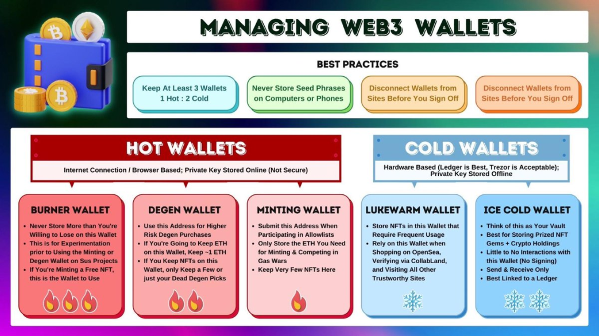

# 🖥 Wallet Safety

## How MetaMask Works

MetaMask is code installed into the browser. It stores an encrypted copy of your private key on disk (this is why you have to enter a password to unlock it). Metamask also tells websites how to interact with it. When you go to a website and "connect" to it, that is just the website saying "hey metamask, ask the user if it's ok if i know their public address". If you connect, it knows your public address. Nothing is compromised and nothing moves.


**A connected site cannot steal your stuff unless you sign something.**

_It is possible for a scam site to compromise your wallet in other ways though, even if you didn't sign a transaction. See_ [different-kinds-of-attacks.md](different-kinds-of-attacks.md "mention") for more.&#x20;


## Best Practices

**Get a hardware wallet**. It's more expensive and not as quick and easy to use, but it is the safest thing you can possibly do to protect your assets.

Write down your hardware wallet seed phrase _with pen and paper_ (not in your notes app, not in an email, don't take a picture of it, not in your LastPass). **NEVER EVER EVER EVER EVER EVER EVER EVER EVER EVER EVER EVER enter your seed phrase into a computer **_**anywhere**_**.**

**Don't click links**. Always go to the site directly. (e.g. if Coinbase emails you asking you to login and do something, go to their site - don't use the email link.)&#x20;

**Keeping a HOT and COLD wallet can help.** The hot wallet can be MetaMask and be on your phone for degen on the go. The cold wallet should be a hardware wallet (like a Ledger or Trezor). You can treat the cold wallet like a vault. One way in, no way out. _(Check out the image below)_

**Always check what you are signing.** This can be challenging sometimes especially on a hardware wallet. One strategy is nickname common contracts & addresses in MetaMask. For instance, if you nickname the FROGS contract FROGS and then you go to another site, and it asks you to sign a transaction going to the FROGS contract, you know something is up.&#x20;

**Token revocation** can help, but this can also be a source for scams. [Revoke.cash](https://revoke.cash/) is a well known and great site, but those sites go down fast under heavy load. **Vaulting** is a better approach, but requires planning.&#x20;

**Disconnecting from sites you are no longer using** is good practice but it's not that useful. The attack here is that if you are connected to a site with more than one account, and the site proposes to sign a transaction for _Account 2_ instead of _Account 1._ If you have nicknamed your accounts and are checking what you are signing this is avoidable.&#x20;

<figure><figcaption></figcaption></figure>

This is a good article on all the ins and outs of how to keep your MetaMask safe [https://coinguides.org/metamask-security/](https://coinguides.org/metamask-security/)
