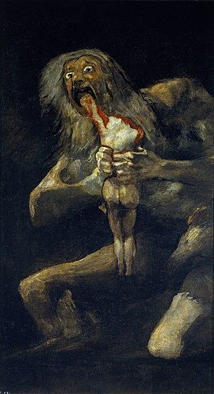

# 👑 Frogland Manifesto

### What Are We Building?

Notorious Frogs. Frogland. NewPangea. NFTs. Metaverse. These words aren’t new to those who’ve been with us from the start, but they are separate facets that bear repeating, both for the benefit of welcoming newcomers and immigrants as well as a kind of mantra for our most loyal and original froggers.

Ask one of us founders, “what’re y’all building, really?” and you may get a few answers — not because we’re not on the same page, but because we’re on _different pages of the same book_. The Notorious Frogs were never meant to be just 10k individual portraits; they are the main characters in a story of epic proportion.

Complexity is OK, especially when arrived at through the interactions of multiple simple elements. Complexity is what makes any story — makes any life, any enterprise — worth living, worth telling, and worth doing. The one thing we will all say, without question, is that what we are building is at the crossroads of belonging and entertainment. Enrichment is relevant in all senses of the word, and a big part of it hinges on the concept of _co-creation_. Co-creation is a term we’ve used from the start, and one that deserves more definition so that its nuances are understood from within and without.

### **Frog Spawn** 

10k Notorious Frog NFTs seeded the startup fund for building out the Frogland sub-continent of the NewPangea metaverse. From the beginning we have used the model of co-creation as a core creative approach, meaning: the founding development team’s primary task has been to build frameworks based upon three key pillars of the Frogland metaverse experience: Social Engagement, Tokenomic Opportunities, and Quirky Adventure. A more detailed dive into the value, application, and magnitude of these pillars has been described [before](https://frogland.gitbook.io/toadex/design/principles-of-newpangea/the-pillars-of-the-metaverse). However, exactly what those pillars are supporting needs more definition especially for those who are new to the project. One of the main purposes of this article is to broaden and accelerate that dialog.

### **Standing on the Shoulders of Giants** 

Conventional versions of the history of arts and sciences describe civilization as having been in a constant state of evolutionary development — “the centuries of progress”. But the past 40 years tell a different story, that those centuries led to where we are now: a world that is shinier in more places, but whose robust abundance exists only at the top echelons of society and businesses, leaving the hollowed majority severely lacking in opportunity and resources. The inexorable accumulation of ‘progress unceasing’ — of externalities unaddressed — towering above us, threatening that imagined glorious future, so close to our grasp, yet unattainable — so long promised as “soon(™) — a “soon” that comes across to many of us as meaning, “never”.

The feeling is known, and has grown — the giants who carry civilization move in directions we cannot control and whose choices cannot be influenced. The trust in the assumption that the past cares about having a future feels thin. Trust in giants is at an all-time low. And one of the ideas that motivates our team is that we have all experienced how newer techniques and technologies have reached a level of complexity that enables a bad kind of irony. The tools that make creativity more accessible are built on platforms which make it more difficult for people to influence and enact change using those tools.

### **Where the Rubber Meets the Road** 

However, the way forward is to light a candle, not curse the darkness. We, the creators of The Notorious Frogs, the architects of the newness that will be NewPangea, the Lords of the Flies — we’re here to tell you that we, too, are made of meat, and are heir to all the flaws that flesh is heir to.

The methodology required for us to develop this project necessitates experimentation. Everything we do, we do with intention, and so it’s important to be transparent with our approach to our community — and all who show interest in Frogland — the good, the bad, and everything in between. Building like this requires the ability to drive up dirty back roads looking for the best way to reach the esoteric citadels, half-shrouded in the hills, on the grasslands, by ponds, at the shorelines. The process of how those _ideas_ of places become _actual_ places, and what the journey to those [unkown __ ](https://frogland.gitbook.io/toadex/frogland/lore/legends)places manifests when we arrive — this is the the road we’re on, and like all roads we will find rocks in the way, potholes, hairpin turns, and, sometimes, when we stop to admire a compelling view, we may wind up hearing the siren sound of eerie banjos and choose to move on, fast.

.png>)

The destination is important and relevant. The journey may feel like living in a desert while waiting to enter a promised land — but don’t forget how compelling a mirage is, and how life-affirming when that mirage isn’t an illusion but a true oasis that slakes thirst and satisfies hunger.

### **The Emergence of a New Culture** 

The appeal of this space is that most everyone is here because of a belief in renewal — the time for co-creation has finally arrived. The tools are advanced and people are done with irony — unless it’s applied ironically. Among the lessons of the culture shift in this post-Post Modern world is that the world today protects itself with a cynicism that is a veil in front of a need for real talk and a purposeful walk.

We see people who are tired of echo chambers that consume and dissolve dreams.

We see people wanting social experiences that revitalize and inspire rather than dull and anesthetize.

We see people who want to be part of a unifying process, one that is an antidote to endless forced feeding of marketing hype and being split into artificial groups defined by arbitrary and uninspired gating of access.

We see people who enjoy knowing how things are made, not looking for ways to destroy others.

We see people who want to make something from nothing — to dream the dream that dreamers dream, and to be part of the process of realization — of an awakening.

We see people who want to be relevant, seen, and heard.

Working in the open and with our community, we’ve committed ourselves to a path that is different from the entertainment companies of the past — and the truth is that we do see Notorious Frogs, Frogland, NewPangea — the whole ball of wax — as an entertainment enterprise. But one that, unlike the centralized entertainment approaches that have existed and succeeded, this next phase of entertainment must be built around the idea that the audience is not just a consumer, not just a spectator who paid for a ticket, but an active participant who needs to be a beneficiary of the world they support and help form.

The most important distinction between the emerging “meet-a-verse” and legacy entertainment is that it depends on invitation to create, refine, course-correct, and grow. The systems we can build now enable this kind of co-creation, and bring us a platform that isn’t one-way, but that is fundamentally structured around the highest form of communication: A Conversation.

.png>)

### **Co-Creation: Discourse and Development** 

“Co-creation” is an awkward sounding word, but it’s the right one to use. It has a couple of weaknesses to address. Foremost is that it invokes the need for interaction but evades the importance of transaction. “Transaction” is itself problematic because on one hand it implies a completely cold process of getting something from someone else, not generating anything — it isn’t personal, it’s just business. However, creation is an inherently emotional and passionate process, whereas creative conversations require personal connection that is inseparable from success.

Co-creation isn’t a singular concept. Co-creation can exist within a black box, which is exactly how writers rooms and engineering think tanks work — and both have proven their process value over many generations. But once you move the co-creation concept into a social realm — with the only gatekeeper being the one rule: “Don’t Be A Dick”, the concept must be coupled with transaction in order for it to work — otherwise all contributing ideas and energy can be just given away for free, or taken without attribution or reward.

The big evolution inherent in what we all clump into the unsexy mouth shape heard as “Web3” is that co-creation and transaction can be encoded to coexist in balance if, and only if, the systems built with that code are designed to do so. Blockchain makes it possible to be a participant _and_ a beneficiary, and makes incremental or segmented contributions traceable to its originator without having to prove it over and over and over again in different venues or systems.

We all want the shock and excitement of The New. We all want lives where proximity to familiars, friends and fun is a simple fact and a simple act. We all want to be in a world where our actions have an effect and that can cascade and create constructive chain reactions.

Where we are — where The Notorious Frogs team’s collective mind is — is that our promise is to supply the framework, to support the will of the creative development culture that permeates our community, and that has declared loud and proud “I Am Frog, Hear Me Roar”. We are here to boost that energy and to become a dividend. Establishing a system that enables active participants to have more exposure to _their_ audience, whether via words or music or imagery, and to supply a mechanism that can reap substantive reward — this, to us, is what we are committed to bring to reality. It’s in the eyes of the Frogs and in the emerging contours and details of the Map. We do this not because it’s easy, but because it is difficult, necessary, and important for the massive amounts of content created by the community will produce both more innovation and fiscal viability than what a black-boxed team of eight could ever come up with on our own.

.png>)

### **Following The White Rabbit** 

A complete answer to “what exactly defines a metaverse” is still emerging, but the Frogland team has always seen the concept and the technologies that comprise Web3 as a pivotal moment in history, one where the users of technology become the beneficiary of social change — not simply the consumers for a centralized system that is based on one-way financial flow and upon the extraction of personal data. This newer world has to be built to guarantee original attribution, enable a system of tokenized royalties and allow contributory or derivative work to propagate in other manifestations envisioned by those who want to use it as a component in their own creations. The strange truth of it all, is that we are all together in this, and that we are all resources for building a world worth waiting for.

We ask for patience. We offer participation. We want to be clear water — transparent, and refreshing. There are times when we may have to change our minds because of the nuances when building with practical magic, or because our community has spoken with the kind of eloquence and fervor that would be wrong to ignore.

Words are easy — we understand that the finger pointing at The Moon is not The Moon. Building is difficult, and building differently takes the power of experience and passion. Our community is filled with both, and for that, alone, we, the founders, feel lucky as fuck.

### _We may be right; we may be crazy…_ 

### _But we just may be the lunatics you’re looking for._ 
