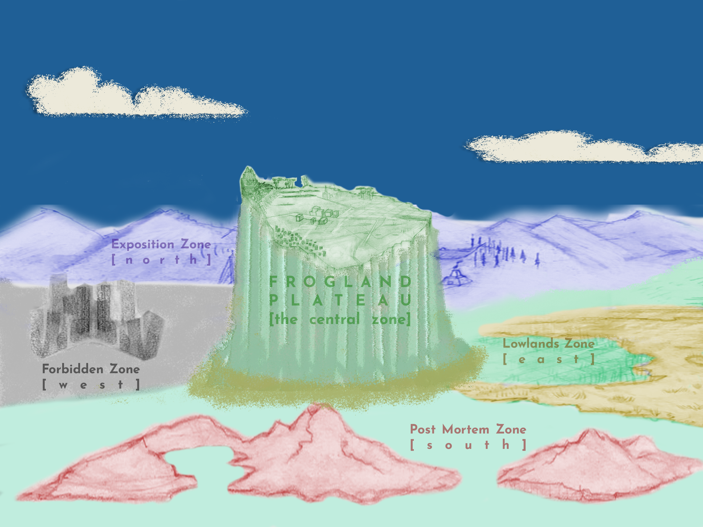

# Geography and Layout

### Map of NewPangea

NewPangea is the overall metaverse, consisting of five zones with each zone having slightly different thematic characteristics.  Partner projects who join NewPangea have their home "district" in a specific zone, but travel between the zones will be possible. Individuals can purchase land in the district belonging to their project, but we are exploring both the option of purchasing land in any district, and the option for a land holder to rent the space.&#x20;

## The Five Zones of NewPangea

### The Central Zone

#### The Plateau

* Unlike the surrounding zones the central plateau contains only one District: Frogland. That limitation serves three purposes:
  * It provides the Notorious Frog holders the distinction of being founders of this metaverse
  * It provides a foundation for developing richly detailed narratives with other projects.  Frogland's centrality puts it into a position of potential power within the metaverse, which may mean it will become a threat, and may mean that it will become a target for takeover
  * The centrality will also assist the development of both in-game and real-world economic systems.  Frogland will be a testing ground for token value and utility, and its journey into those areas will inform other projects about what works, what hasn't, and what opportunities can be filled by the culture and economy they bring to the metaverse. &#x20;
* Frogland will have neighborhoods that are defined by habitat and function. For example, there is a main street, "Amphibian Way", a downtown of sorts, plus there will be subsidiary areas that will have their own flavor of businesses, such as Frogland's "Green Light" neighborhood, a "Frog Worts" arcane area, and outskirts known as the "Borderlands".  There will be ponds, some smaller, some larger, most of them primarily residential areas, but others might develop as either recreational or industrial areas. Some of the land is reserved for business, including farming and manufacturing.
* Frogland has lots of fresh water, but water cascading over its edges carries away soil nutrients that limit the kind of plants that can grow there. Some of these plants have developed aggressive root systems that slowly strangle subsurface volcanic rock to extract nutrients. There are at least two species of plant that have developed the ability to eat large insects and small animals to feed their needs.
* Frogland also has areas of dense tropical forest. Hidden in the depths of these forests are ruins of an unknown origin.
* The discovery of broad, sinuous tunnels under the surface lead to the theory that the underground passageways may have been fumaroles of a now defunct volcano. However, other explanations are possible. One group of Frogs believes them to be the home of an extinct underground species - or possibly one that has migrated underground and now inhabits the subsurface below one or more of the vast territory of the surrounding zones. One particular Frog, who has chosen to live in the tunnels and who only emerges on the surface at night claims that there are petroglyphs on the walls of some tunnels, and that the drawings on the walls depict a creature that no Frog has ever seen.

## The Other Four Zones Surrounding Frogland's Plateau

### The Forbidden Zone

* To the west of the Frogland Plateau
* General Theme is "Outlands and Wilderness" (note that 'wilderness' does not mean only forests – deserts are 'wilderness', so is 'tundra'.
* The Ruined City is a City that can have multiple Districts.
* "Gutterville" is the home District for The Gutter Cat Gang

### The Post-Mortem Zone

* To the south of the Frogland Plateau
* General theme is "The Otherworld" ie, The Afterlife
* The Island of Osseous – the home district to the undead Wicked Craniums is an example of a City that is intended to have only one District – presumption is that the Craniums want the island for themselves.

### The Lowlands Zone

* To the east of Frogland's Plateau
* General theme is "Mud and Flood – Lakes and Creeks"
* Not populated yet
* A Swamp District is reserved for some of our favorite higher primates for now.
* The City of Black Water (provisional)

### The Exposition Zone

* To the north of Frogland's Plateau
* General theme is: "a laboratory/playground/workshop for the world's creative future"
* It's Districts differ from the NFT-Collectibles Districts in unique ways
* The Districts are themed by creative venues and galleries, performance spaces, stages&#x20;
