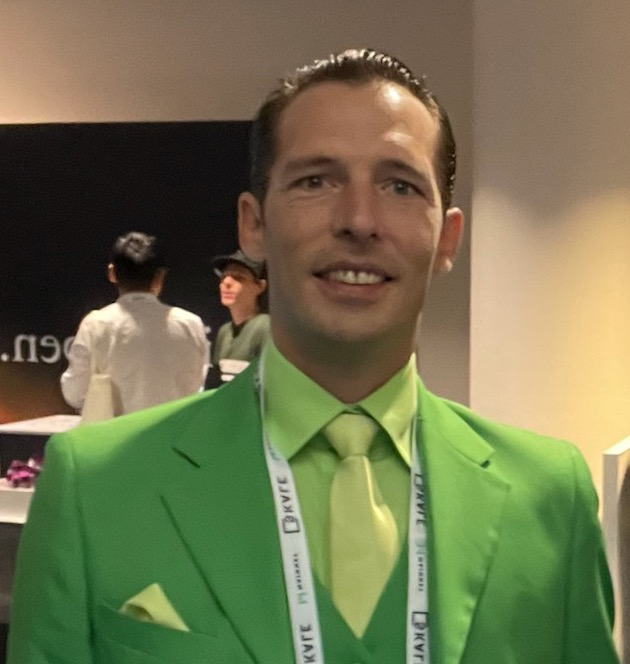
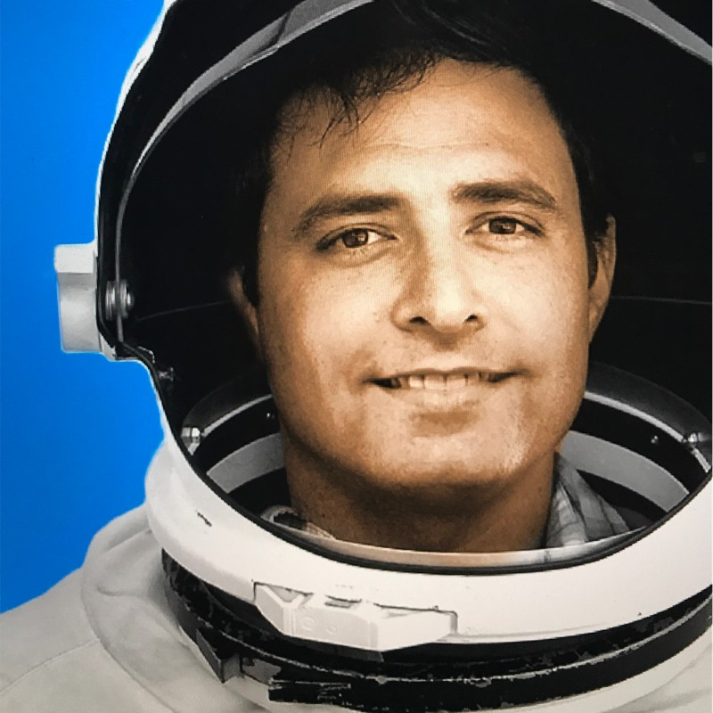
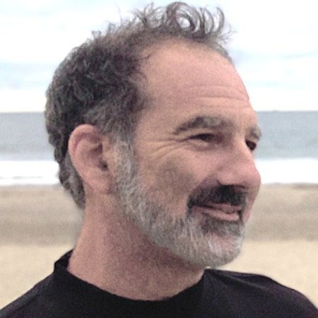
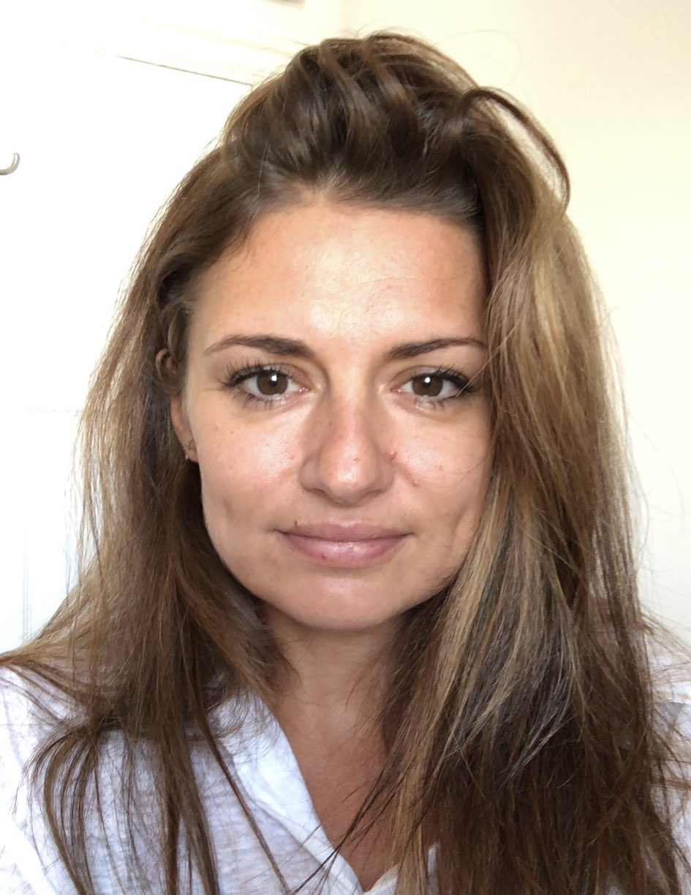
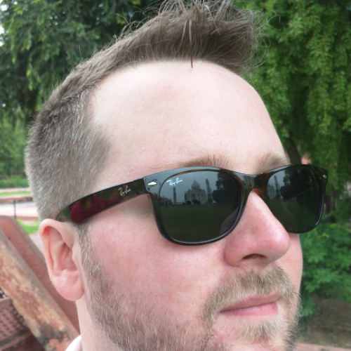
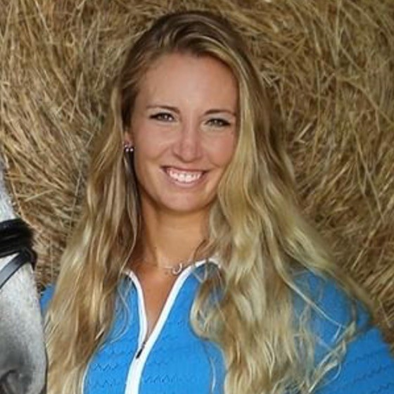

# 💚 The Frog Team

## The Frogland Founders

### Snoop Frog, CEF (Chief Executive Frog)

___and in frog form:___

A Silicon Valley CEO with a track record developing innovative technologies, Snoop developed partnerships with Nvidia and built products and prototypes for Samsung and Mattel. A Judge at the Bermuda International Film Festival, Snoop recently presented NFTs and Frogland and the NewPangea metaverse to the United Nations.

### Shrimp, CCF (Chief Creative Frog)

_and in frog form:___

A Creative Director with years experience in Hollywood working on iconic IP such as Star Wars, Pirates and Transformers. In Real Life, Shimp, is known for designing Harry Potter’s Patronus, co-creator of the 19 Crimes Talking Wine Bottle, and even helped build Michael Jackson’s hologram for the Live broadcast of “Slave to the Rhythm” at the Billboard Awards Show.

### Bugs, CNF (Chief Narrative Frog)

_and in frog form:_ __&#x20;

Animator, CG Supervisor, Graphic Designer, Screenwriter and Novelist. Bugs has worked on everything from video games to national brand advertising to children's television shows to Disney features. Bugs and Shrimp have had a creative partnership for a decade and together form our visual story and game development Dynamic Duo who shape the total narrative vision for Notorious Frogs.

### Frogzilla, FFA (Frog Fine Artist)

___and in frog form:___

A renowned fine artist inspired by the trips to the pond with her father, spawned this amazing project to make the frogs live forever. Having spent the last 12 years between London and Bermuda looking for what is beyond abstraction, Frogzilla discovered that generative art is the next evolution in the art world. Having sold artwork at the prestigious Lots Road Auction House in Central London, Frogzilla has no backlog of unsold art. Traditional art has never felt near as personal nor exciting as creating art for the NFT space. Having been mentored and certified from the Museum of Modern Art, Frogzilla learned a valuable lesson of staying true to herself so that anyone can see it in the originality of her work.

### Gamabunta, CToF (Chief Tokenomic Frog)

_and in frog form:___

Also known as Don-Luv from the PizzaDao, Gamabunta is a wizard and our tokenomics director. Gamabunta co-founded an energy software company in 2012 and a blockchain education company in 2017. Now full time crypto and NFTs builder, he is working on Frogland’s generator, tokenomics, game design, and land mechanics.

### Froggy Digital, CTeF (Chief Technical Frog)

_and in frog form:___

A Weapon of Mass Construction, building software anywhere code runs. This frog is an expert at bringing software products to market across a range of industries and building media experiences for organizations you know and love such as NPR and Discovery Communications. Most recently, he’s been working for Microsoft to develop Election Guard, an end to end verifiably encrypted voting software used by the House of Representatives in the 2020 caucus.

### Lollihops, CPCF (Chief Production & Community Frog)

_and in frog form:___

Coming from a work background dealing in the importance of human connection and communication through more than just spoken word, Lollihops made the leap into full time crypto and NFTs shortly after the launch of Frogland. Fondly known as the Chief Cat Herder, she is the touch point between all internal and external branches of the project, including the members of the community, partner projects, and game dev studio. She ensures the fluid blending of community vision with creative and narrative direction in the testbed of the discord, then integrated into the gameplay and aesthetic of the metaverse.

## Full Time Staff

